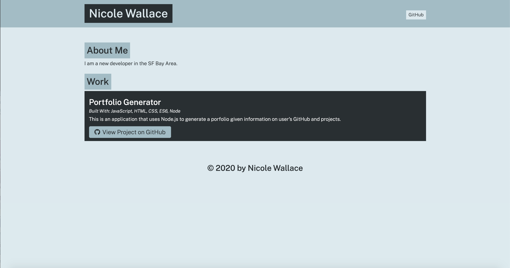

# Portfolio Generator 
  

## Description 
This application was created to generate portfolios with Node.js given information on user's Github and project details. 

## Table of Contents
* [Installation](#installation)
* [Usage](#usage)
* [License](#license)
* [Contributing](#contributing)
* [Tests](#tests)
* [Questions](#questions)

## Installation 
The user should clone the repository from GitHub and download Node. This application also requires a file system and inquirer module. 

## Usage 
Use inquirer from your command line to answer questions about your project.
 

## License 
This project is license under MIT

## Contributing 
Contributors should read the installation section. 

## Tests
npm test

## Questions
If you have any questions about this projects, please contact me directly at nicole.elisaw@gmail.com. You can view more of my projects at https://github.com/nicolewallace09.
